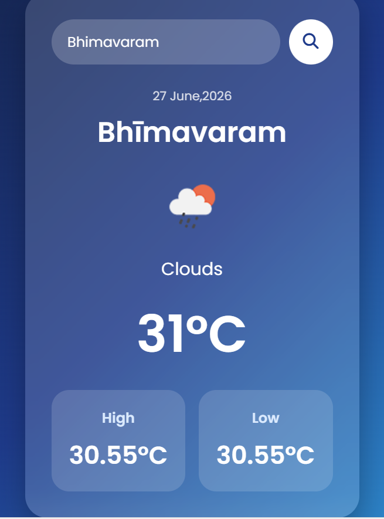

# 🌦️ Weather App

A responsive weather application built using HTML, CSS, and JavaScript that fetches real-time weather data using the OpenWeather API.

## 🚀 Features

- Search weather by city name
- Display current temperature
- Show weather conditions
- Display maximum and minimum temperatures
- Dynamic weather icons
- Error handling for invalid city names

## 🛠️ Technologies Used

- HTML5
- CSS3
- JavaScript
- Fetch API
- OpenWeather API

## 📷 Screenshot

## 📚 What I Learned

- Working with REST APIs
- Fetch API and asynchronous JavaScript
- Handling JSON data
- DOM manipulation
- Error handling
- Responsive web design

## 👨‍💻 Author

Navya Varikuti

GitHub: https://github.com/navyavarikuti

LinkedIn: https://www.linkedin.com/in/navyavarikuti/
